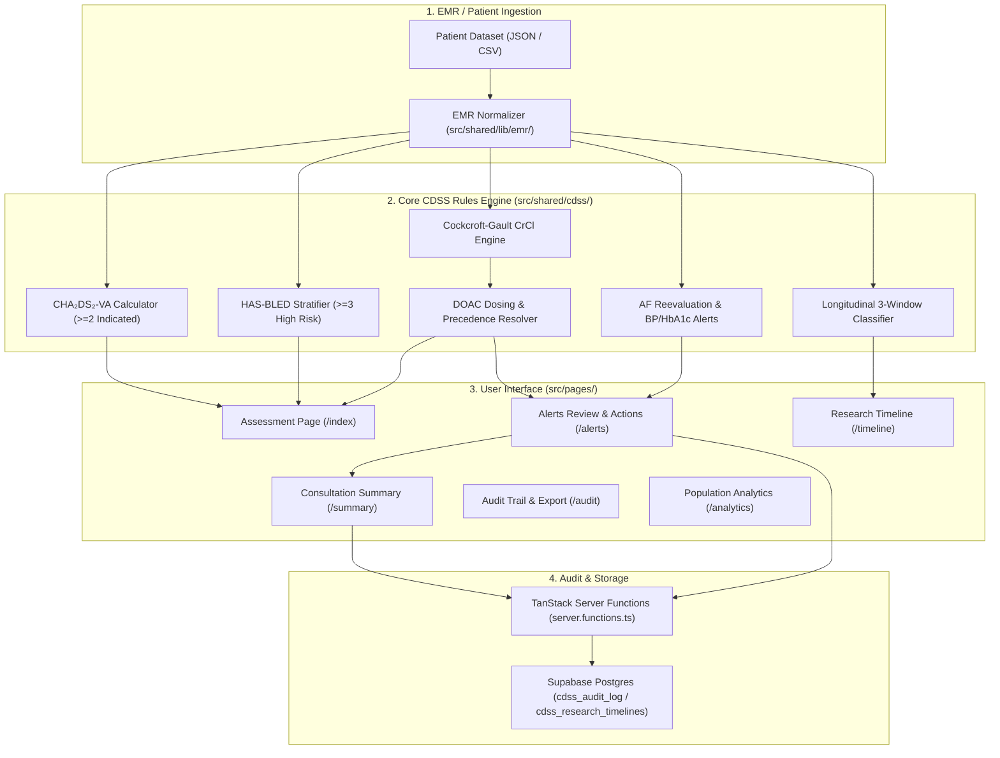

# 🏛️ AF Care Companion - System Architecture & Data Flow

This document details the architectural components, clinical evaluation pipeline, data flows, and persistence mechanisms of the AF Care Companion Clinical Decision Support System (CDSS).

---

## 1. High-Level Data Flow Diagram

---

## 2. Component Layers Breakdown

### Layer 1: EMR Ingestion & Normalization (`src/shared/lib/emr/`)

- Normalizes raw incoming patient clinical models (diagnoses codes, lab tests, vital records, ECG findings, and active medications).
- Decouples raw clinic database schemas from the internal `Patient` model.
- Supports switching adapters via `CDSS_EMR_ADAPTER` environment variable (`mock`, `fhir`, `hl7`).

### Layer 2: CDSS Evaluation Engine (`src/shared/cdss/`)

- Evaluates clinical risk factors using deterministic medical rules:
  1. **Stroke Risk (`rules/strokeRisk.ts`)**: Calculates sex-neutral CHA₂DS₂-VA score. Triggers anticoagulation recommendation if score ≥ 2.
  2. **Bleeding Risk (`rules/bleedingRisk.ts`)**: Computes HAS-BLED score. High bleeding risk (≥3) generates warning alerts without overriding stroke prevention indications.
  3. **Renal Safety & DOAC Dosing (`rules/drugDose.ts`, `rules/renalSafety.ts`)**: Calculates CrCl via Cockcroft-Gault formula using serum creatinine, age, sex, and weight. Executes drug-specific dose reduction rules (Apixaban 2-of-3 criteria, Dabigatran age bands, Rivaroxaban renal clearance).
  4. **Precedence Resolution (`engine.ts`)**: Ensures critical contraindications (e.g. `Avoid Rivaroxaban CrCl < 15`) cleanly suppress secondary review alerts.
  5. **Longitudinal Research Classifier (`researchTimeline.ts`)**: Categorizes clinical events into 3 research windows:
     - **Pre-Alert Window**: -12 months to -1 day before the index consultation.
     - **Index Encounter**: Consultation date (Day 0).
     - **Post-Alert Window**: +1 day to +3 months following the CDSS decision.

### Layer 3: Frontend Feature Domains (`src/pages/`)

- Feature-colocated page modules providing dedicated views:
  - **`assessment/`**: Live risk score calculators, hybrid score override dialogs, and clinic eligibility gating.
  - **`alerts/`**: Sequential action review queue (Accept, Defer with review date, Override with mandatory reason codes).
  - **`patients/`**: Cohort registry search, filtering, and 1-click cohort switching.
  - **`summary/`**: Doctor's consultation discharge summary note generator.
  - **`timeline/`**: Multi-window clinical timeline visualization.
  - **`analytics/`**: Epidemiology dashboard and guideline adherence metrics.
  - **`audit/`**: CDSS decision audit log with full snapshot inspection and CSV export.

### Layer 4: Persistence & Audit Logging (`src/shared/cdss/server.functions.ts` & `supabase/`)

- Implements immutable clinical audit trail logging.
- Captures clinician IDs, visit identifiers, timestamp, input parameters snapshot, triggered alert rationale, and selected decision actions.
